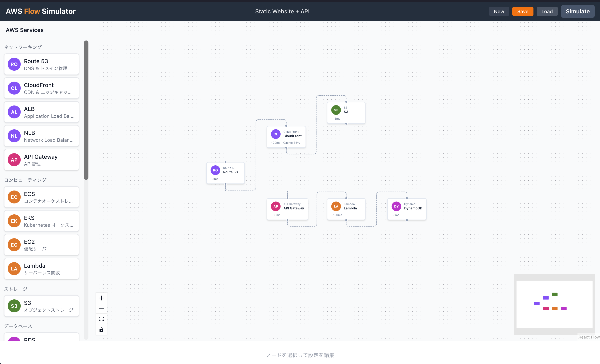
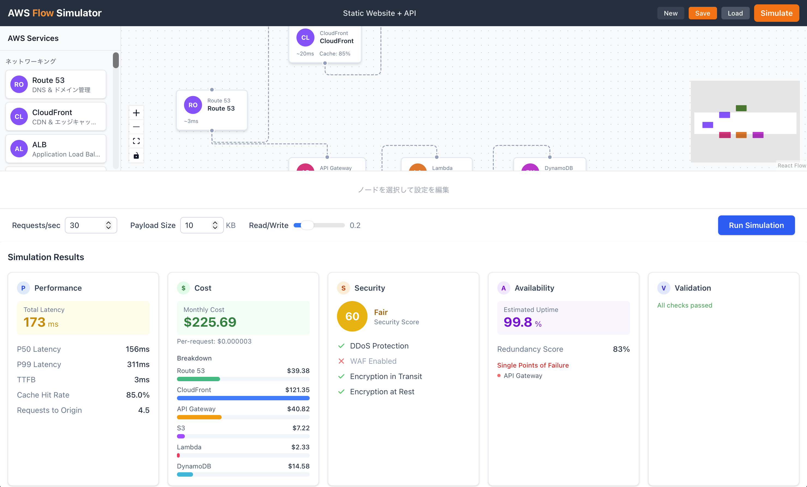

# AWS Flow Simulator

AWS アーキテクチャをドラッグ&ドロップで構築し、パフォーマンス・コスト・セキュリティをシミュレーションできるインタラクティブツール。



サービスパレットからノードを配置し、接続を描くだけでアーキテクチャが完成。**Simulate** ボタンで即座に分析結果を確認できます。



## 主要機能

- **ドラッグ&ドロップ構築** - AWS サービスをキャンバスにドラッグして配置し、接続線で繋いでアーキテクチャを設計
- **シミュレーション実行** - トラフィックプロファイルを設定して、パフォーマンス・コスト・セキュリティ・可用性を分析
- **接続バリデーション** - サービス間の接続ルールを自動チェック（非推奨接続には警告を表示）
- **サービス別スペック設定** - EC2 インスタンスタイプ、RDS Multi-AZ、Lambda メモリなどの詳細設定
- **コスト自動計算** - スペック変更に連動した月額コストの自動更新
- **保存/読込** - IndexedDB によるローカル保存。プリセットアーキテクチャも用意
- **プリセットパターン** - Basic Web App、Serverless API、EKS Microservices、Event-Driven Architecture 等 6 パターンを初期搭載

## Getting Started

```bash
npm install
npm run dev
```

ブラウザで `http://localhost:5173` を開く。

## 使い方

### 1. サービスの配置

左のパレットから AWS サービスをキャンバスにドラッグ&ドロップ。

### 2. サービスの接続

ノードのハンドル（接続点）からドラッグして別のノードに繋ぐ。無効な接続は理由付きで拒否される。

### 3. 設定の調整

ノードをクリックすると下部に設定パネルが表示される。基本設定、レイテンシ、キャッシュ、コスト、セキュリティに加え、サービス固有のスペック（インスタンスタイプ、タスク数など）を設定可能。

### 4. シミュレーション

シミュレーションコントロールでトラフィックプロファイル（RPS、ペイロードサイズ等）を設定し、実行。結果はパフォーマンス（レイテンシ、キャッシュヒット率）、コスト（月額、リクエスト単価）、セキュリティスコア、可用性（SPoF、推定稼働率）で表示。

### 5. 保存と読込

ヘッダーの保存/読込ボタンでアーキテクチャを IndexedDB に保存・復元。初回起動時にはプリセットアーキテクチャが自動登録される。

## 対応 AWS サービス

| カテゴリ | サービス |
|---------|---------|
| ネットワーキング | Route 53, CloudFront, ALB, NLB, API Gateway |
| コンピュート | ECS, EKS, EC2, Lambda |
| ストレージ | S3 |
| データベース | RDS, DynamoDB, ElastiCache |
| メッセージング | SQS, SNS, Kinesis |
| セキュリティ | WAF, Shield |
| インフラストラクチャ | VPC, Subnet, Security Group, NAT Gateway, Internet Gateway |

## Tech Stack

- React 19 + TypeScript 5.9
- Vite 7
- @xyflow/react (React Flow)
- Zustand
- Tailwind CSS 4
- IndexedDB (idb)
- Zod
- Vitest + Testing Library

## License

MIT